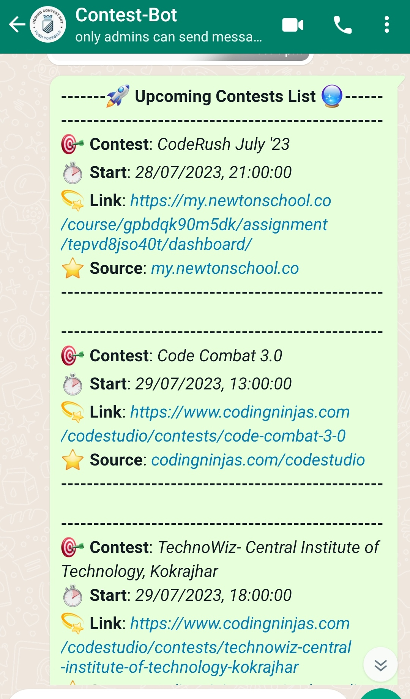

# Contest Bot 🎯

Welcome to the Contest Bot - will remind you about all upcoming contests happening on various platforms, ensuring you stay on top of game and improve it on WhatsApp! 🎉🤖


## Screenshots

|      **New Job Notification**           |
|------------------------------------- |
|  |

## Deployment Procedure using MicroSoft Azure 🚀

To deploy Contest Bot on  Microsoft Azure, follow these steps:

1. **Create an Azure Virtual Machine Instance**: Connect to this virtual machine with the using local machine PowerShell.

    **Other Information**:
    
   a) Using a Linux subsystem like WSL or Ubuntu on Terminal?
    
   b) Copy your private key path to the Linux subsystem and ensure it has the       correct read-only access.
   
   c) Move your private key to the Linux subsystem. Use chmod to assign read-only access, then SSH.
   
    ```bash
   mv /mnt/c/<your-private-key> ~/.ssh/
   chmod 400 ~/.ssh/<your-private-key>
   ```
   

2. **Connect to the Azure VM**: Use SSH to connect to the VM instance using the key pair you created. You can use the following command:

   ```bash
   ssh -i your-key-pair.pem azureuser@your-azure-machine-ip
   ```

3. **Install Node.js**: Install Node.js on the AZURE VM instance by running the following commands:

   ```bash
   curl -o- https://raw.githubusercontent.com/nvm-sh/nvm/v0.38.0/install.sh | bash
   source ~/.bashrc
   nvm install node
   ```

4. **Install MongoDB**: Install MongoDB on the Azure VM instance by following the MongoDB installation guide. You can choose the appropriate method for your instance's operating system.

5. **Clone the Contest Bot Repository**: Clone the Contest Bot repository from GitHub onto your Microsoft Azure VM using the following command:

   ```bash
   https://github.com/parth782/ContestBot.git
   ```

6. **Install Dependencies**: Navigate to the ContestBot directory and install the required dependencies by running the following command:

   ```bash
   cd ContestBot
   npm install
   ```

7. **Configure Environment Variables**: Set up the necessary environment variables for the Contest Bot. This may include database connection details, API keys, and other configurations. Create a `.env` file in the root directory and specify the required variables.

8. **Start the Bot**: Start the Contest Bot application by running the following command:

   ```bash
   npm start
   ```
9. **Keeping Application Alive**: PM2 is a Node. js process manager that comes with a built-in load balancer. It helps facilitate production deployments and enables you to keep running applications alive indefinitely.

**PM2 Commands**: To install pm2 use command:
   ```bash
   npm i pm2 -g 
   ```
To start pm2 job use command:
   ```bash
  pm2 start index
   ```
   To stop or kill pm2 job use command:
   ```bash
  pm2 stop index (stop the job)
  pm2 kill index (to permanently kill the job)
   ```
   
   To restart pm2 job use command:
   ```bash
  pm2 restart index
   ```
  To check pm2 status or log use command:
   ```bash
  pm2 status (for status)
  pm2 log (for logs)
   ```
   


Congratulations! Your Contest Bot is now deployed on Microsoft Azure VM and ready to remind you about the upcoming contest on WhatsApp! 🎉🤖

## Tech Stack 🛠️

Contest Bot is built using the following

 technologies:

-  Node.js: Server-side JavaScript runtime environment.
-  MongoDB: NoSQL database for storing contest data for faster access.
-  Azure VM: Cloud-based virtual machine for hosting the bot.

Feel free to explore and enhance the capabilities of Contest Bot with this powerful tech stack!

Stay connected, stay informed, and let Contest Bot makes sure to remind about the upcoming contests on various platforms📱🎯